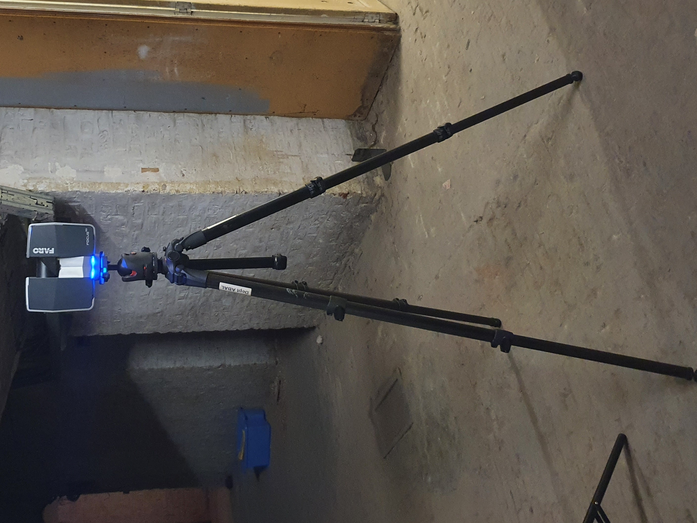
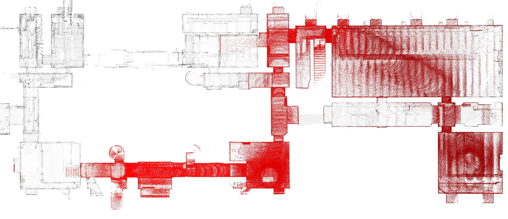

# Ground truth
{: .no_toc }

## Table of contents
{: .no_toc .text-delta }

1. TOC
{:toc}

---

{: style="float: right; margin-left: 1em" width="33%"}

## Mapping


We provide a survey-grade ground truth map collected with a FARO Focus laser scanner (shown in the picture on the right) in PCD format. Two versions are available:

- map_gt.pcd: full map featuring 336M points and weighing 5.4GB
- map_gt_light.pcd: downsampled map weighing 200MB.

You can download the original scans via the links in the Download section and use e.g. [CloudCompare] to read the files.

## Localization


Following the procedure used in other SLAM datasets (MCD-VIRAL, Newer College dataset), we compute ground truth localization by registering the Livox Mid-360's point clouds to the ground truth map. We do so after de-skewing and transforming in the coordinate frame of the IMU:
- trajectory_mid360.csv

Then, we use the extrinsic calibration of the sensors to compute the trajectories of each vision sensor:

- trajectory_7s.csv
- trajectory_k4a.csv
- trajectory_d455f.csv

The csv files are in [TUM format], i.e. `timestamp, x, y, z, qx, qy, qz, qw`:

```text
1725010554.9004323 44.1902339434972 -7.48528514021661 -0.2981489326505714 -0.1081954048536055 -0.05253377745240614 0.869984381558808 -0.4781852491345275
1725010555.0002716 44.1923995463666 -7.47122320852265 -0.3464132430317018 -0.1181440720044682 -0.0710616843673312 0.8690722789462457 -0.4750848232507487
1725010555.1001115 44.1919577887086 -7.47259115986455 -0.3466711344844200 -0.1181706948745240 -0.07125504009204596 0.869050643016538 -0.47508881912530987
1725010555.2004313 44.1912912981102 -7.47155853067434 -0.3459353276136585 -0.1182181065782212 -0.07133930239975407 0.869036756566597 -0.4750897799336751
1725010555.3002715 44.1915069783180 -7.47244809864874 -0.3459356312609733 -0.1184078006989503 -0.07139376452948795 0.869012047629454 -0.47507955570180843
```



*Ongoing registration of the Livox Mid-360 de-skewed scans (red) in the ground truth map*


[CloudCompare]: https://www.cloudcompare.org/release/index.html

[TUM format]: https://github.com/MichaelGrupp/evo/wiki/Formats#tum---tum-rgb-d-dataset-trajectory-format