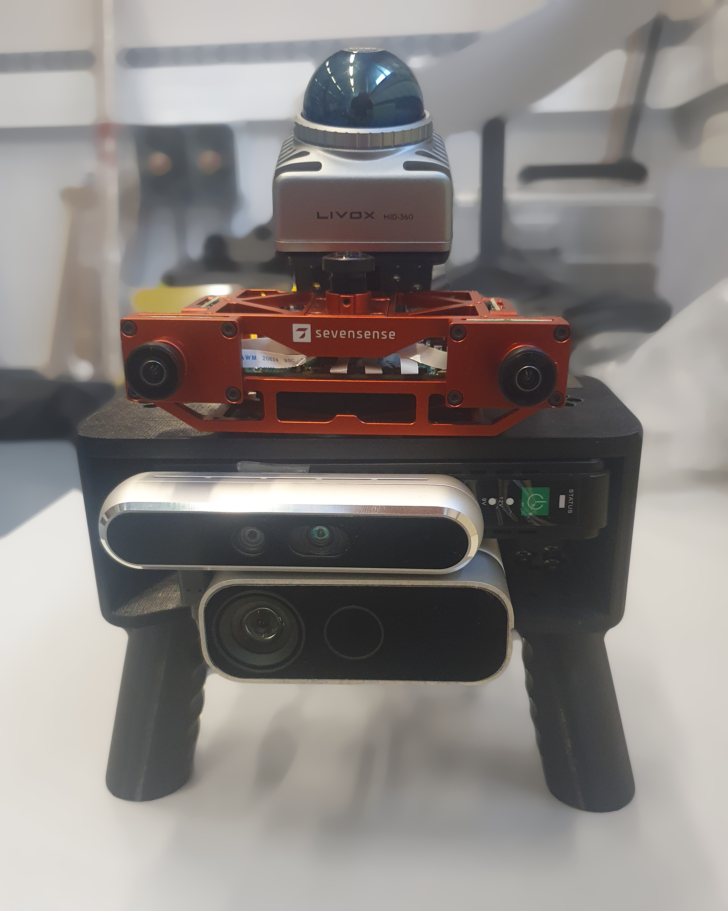

# Sensors
{: .no_toc }

## Table of contents
{: .no_toc .text-delta }

1. TOC
{:toc}

---

## Sensor rig

{: style="float: left; margin-right: 1em" width="33%" m}

Our 3D-printed hand-held setup features the following sensors:
- [Sevensense Core Research]
- [Intel Realsense D455F]
- [Microsoft Kinect for Azure]
- [Livox Mid-360]

All sensors are connected to an [ASUS NUC 13 Pro NUC13ANHi7] with dual ethernet network interface card (NIC). 

The Sevensense Core Research sensor and the Livox Mid-360 are synchronized with hardware PTP. The two other cameras are USB-connected so time synchronization is only possible at the software level.

## Included topics

All of the rosbags in our dataset include the following topics:

| Hardware | ROS topic | Message type | Rate (Hz) | 
|:-----------------|:------------------------------|:---|:---|
| Sevensense Core Research           | /alphasense_driver_ros/cam0/compressed | sensor_msgs/CompressedImage | 15 | 
| | /alphasense_driver_ros/cam1/compressed | sensor_msgs/CompressedImage | 15 | 
| | /alphasense_driver_ros/cam2/compressed | sensor_msgs/CompressedImage | 15 | 
| | /alphasense_driver_ros/cam3/compressed | sensor_msgs/CompressedImage | 15 | 
| | /alphasense_driver_ros/cam4/compressed | sensor_msgs/CompressedImage | 15 | 
| | /alphasense_driver_ros/imu | sensor_msgs/Imu | 400 | 
| Intel Realsense D455F | /d455f/color/image_raw/compressed    | sensor_msgs/CompressedImage | 15 | 
| | /d455f/depth/color/points                     | sensor_msgs/PointCloud2    | 15 | 
| | /d455f/depth/image_rect_raw/compressedDepth   | sensor_msgs/CompressedImage| 15 | 
| | /d455f/imu                                    | sensor_msgs/Imu            | 400 | 
| | /d455f/infra1/image_rect_raw/compressed       | sensor_msgs/CompressedImage| 15 | 
| | /d455f/infra2/image_rect_raw/compressed       | sensor_msgs/CompressedImage| 15 |
| Microsoft Kinect for Azure | /k4a/rgb/image_raw/compressed                 | sensor_msgs/CompressedImage| 15 | 
| | /k4a/depth/image_raw/compressedDepth          | sensor_msgs/CompressedImage| 15 |
| | /k4a/points2                                  | sensor_msgs/PointCloud2    | 15 | 
| | /k4a/imu                                      | sensor_msgs/Imu            | 400 |
| Livox Mid360 | /livox/imu                                    | sensor_msgs/Imu           | 400 | 
| | /livox/lidar                                  | livox_ros_driver2/CustomMsg | 10

All image topics are compressed with the standard `image_transport` and `depth_image_transport` packages. 

## Calibration

[Sevensense Core Research]: https://www.sevensense.ai/product/core-research
[Intel Realsense D455F]: https://www.intelrealsense.com/depth-camera-d455f/
[Microsoft Kinect for Azure]: https://learn.microsoft.com/en-us/previous-versions/azure/kinect-dk/
[Livox Mid-360]: https://www.livoxtech.com/mid-360
[ASUS NUC 13 Pro NUC13ANHi7]: https://www.asus.com/displays-desktops/nucs/nuc-mini-pcs/asus-nuc-13-pro/