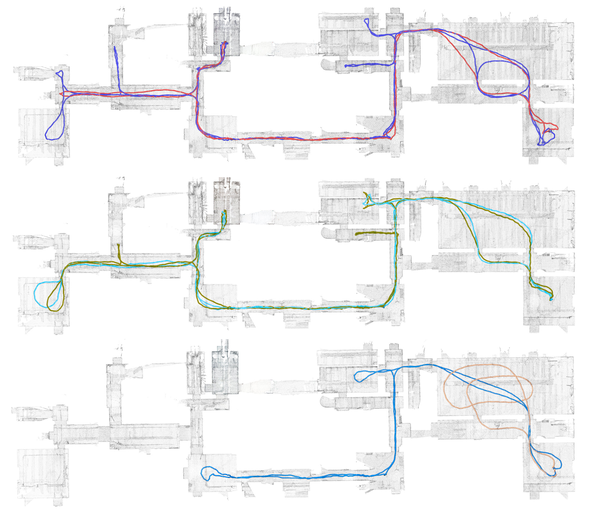

# Sequences
{: .no_toc }

## Table of contents
{: .no_toc .text-delta }

1. TOC
{:toc}

---

We have collected three types of sequences, for calibration, quick testing and actual evaluation of algorithms.

## Calibration sequences

| Name | Description | Duration [s] | 
|:-----|:------------|:---|
| Slow  | Different poses, smooth motion  | 65 |
| Fast | Fast rotation and translation  | 33 |

Both calibration sequences are captured in the same room, illustrated in the figure below:

## Warm-up sequences

We propose two short sequences for researches wanting to have a quick glance at the sensor data and the generic outlook of the environment captured in our dataset:

| Name | Description | Length [m] | Duration [s] | 
|:-----|:------------|:---|:---|
| Small room | Loop in a small room | 13 | 45 |
| Large room | Loop in a large room | 35 | 53 |

The large room is shown in the following figure:

## Evaluation sequences

*The six evaluation sequences. \
Top: red: Reg-1, blue: Reg-2. \
Middle: teal: Deg-Vis-1, green: Deg-Vis-2 \
Bottom: light blue: Deg-Geo-1, orange: Deg-Geo-2*

These sequences are the ones used for the actual evaluation of algorithms. We propose two *regular* sequences (*Reg-\**), two sequences with degenerate visual features (dynamic scenes and lights turned off and on, *Deg-Vis-\**), and two sequences with degenerate geometrical features (recording only the ground plane or a wall, *Deg-Geo-\**).

| Name | Description | Length [m] | Duration [s] | 
|:-----|:------------|:---|:---|
| Reg-1 | Smooth motion, stable features | 210 | 347 |
| Reg-2 | Faster motion, narrower spaces | 297 | 551|
| Deg-Vis-1 | Person moving in FoV | 234 | 328 |
| Deg-Vis-2 | Person moving, unstable lighting | 250 | 410|
| Deg-Geo-1 | Light geometrical degeneracy | 159 | 203 |
| Deg-Geo-2 | Strong geometrical degeneracy | 74 | 85 |
