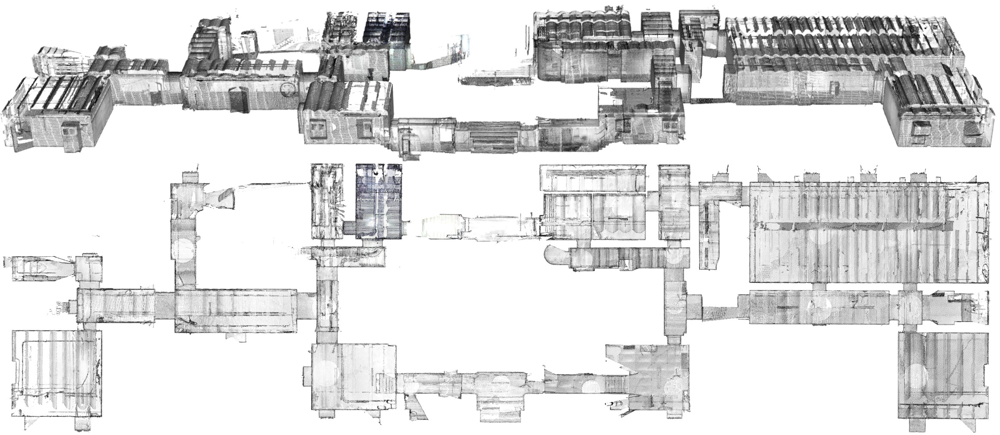
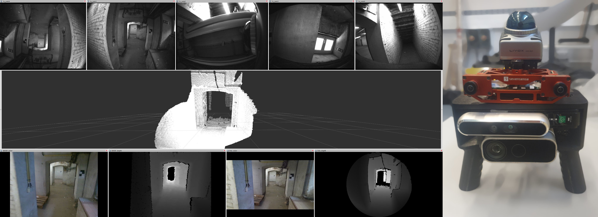

# Depth-Visual-Inertial Dataset for 3D Indoor Reconstruction

---



*Top and middle: ground truth map. Bottom left: sample visualization of some of the RGB and depth sensor streams. Bottom, right: sensor platform.*


## About 
This site presents the dataset collected for our ongoing research on portable 3D mapping systems based on depth cameras. Targeting resource and time-constrained mapping operations (e.g. in the context of search-and-rescue), our sequences we include agressive motion, sequences with people moving in the field of view of the sensors as well as sequences with abrupt lighting changes.

Our sensor platform has an extensive set of sensors:
- 3D LiDAR
- Active stereo camera
- Passive stereo camera
- Time-of-flight camera
- Multiple Inertial Measurement Units (IMUs)

With this selection of sensors, our dataset allows the comparison of various depth sensing modalities for the task of 3D reconstruction in a challenging, large-scale environment. This environment aims to resemble a typical search-and-rescue operation site and is captured in a large, 1600m<sup>2</sup> area made of small corridors, rooms of all sizes and shapes and various objects. 

To provide 


## Authors 

- Charles Hamesse<sup>1, 2</sup> (corresponding author - *firstname*.*lastname*@mil.be)
- Michiel Vlaminck<sup>2</sup> 
- Hiep Luong<sup>2</sup> 
- Rob Haelterman<sup>1</sup> 

Special thanks to Alain Vanhove, Mario Malizia and Timothée Fréville.

1. Royal Military Academy of Belgium
2. Ghent University


## Citation

- BibTeX:

```
to do
```

----

[^1]: [It can take up to 10 minutes for changes to your site to publish after you push the changes to GitHub](https://docs.github.com/en/pages/setting-up-a-github-pages-site-with-jekyll/creating-a-github-pages-site-with-jekyll#creating-your-site).

[^2]: [It can take up to 10 minutes for changes to your site to publish after you push the changes to GitHub](https://docs.github.com/en/pages/setting-up-a-github-pages-site-with-jekyll/creating-a-github-pages-site-with-jekyll#creating-your-site).

[Just the Docs]: https://just-the-docs.github.io/just-the-docs/
[GitHub Pages]: https://docs.github.com/en/pages
[README]: https://github.com/just-the-docs/just-the-docs-template/blob/main/README.md
[Jekyll]: https://jekyllrb.com
[GitHub Pages / Actions workflow]: https://github.blog/changelog/2022-07-27-github-pages-custom-github-actions-workflows-beta/
[use this template]: https://github.com/just-the-docs/just-the-docs-template/generate
